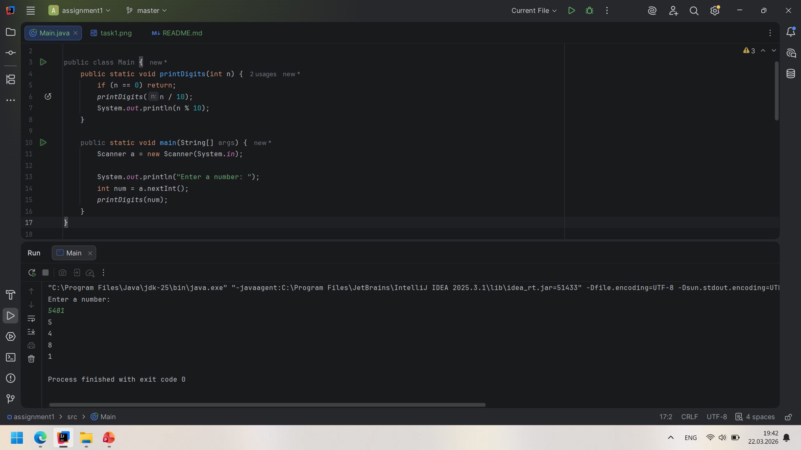
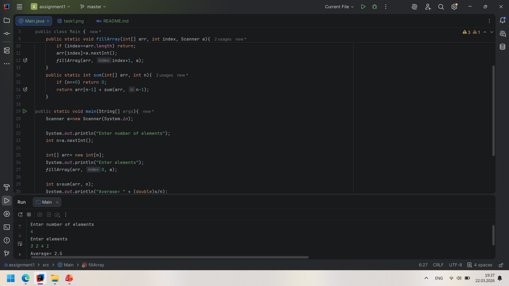
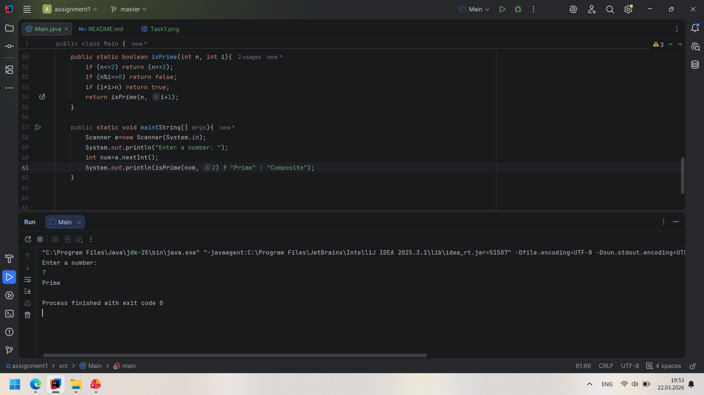
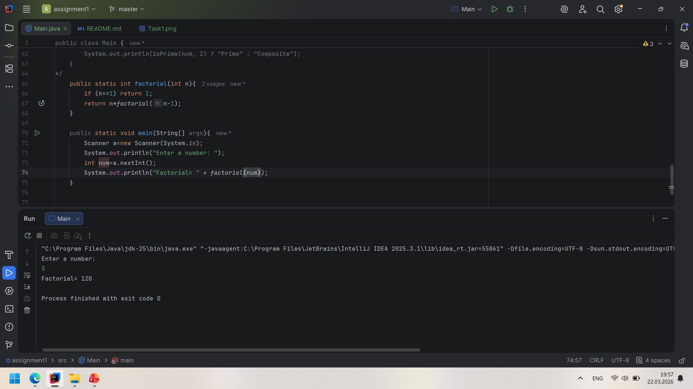
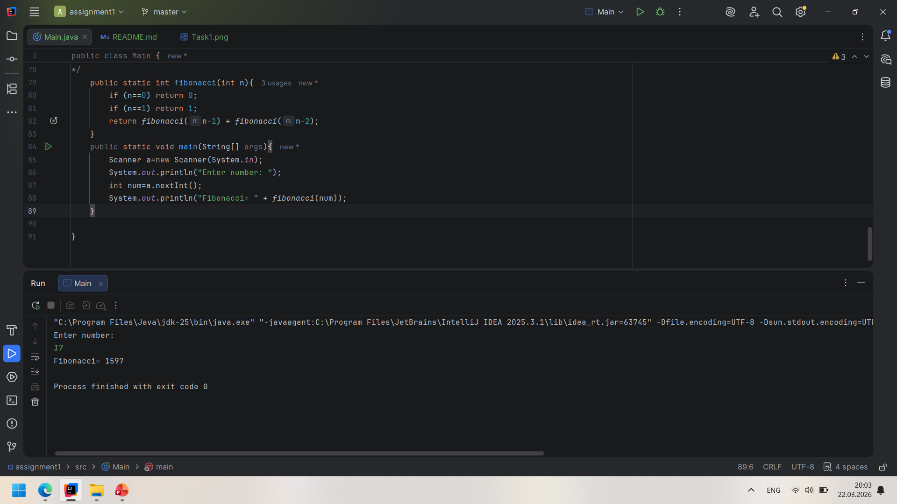
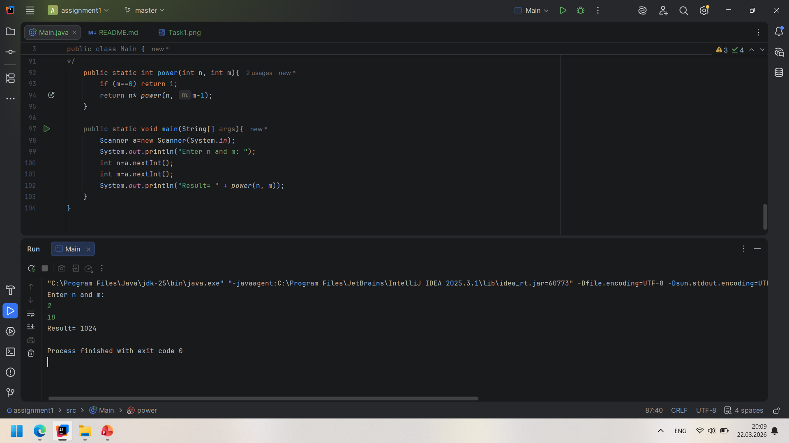
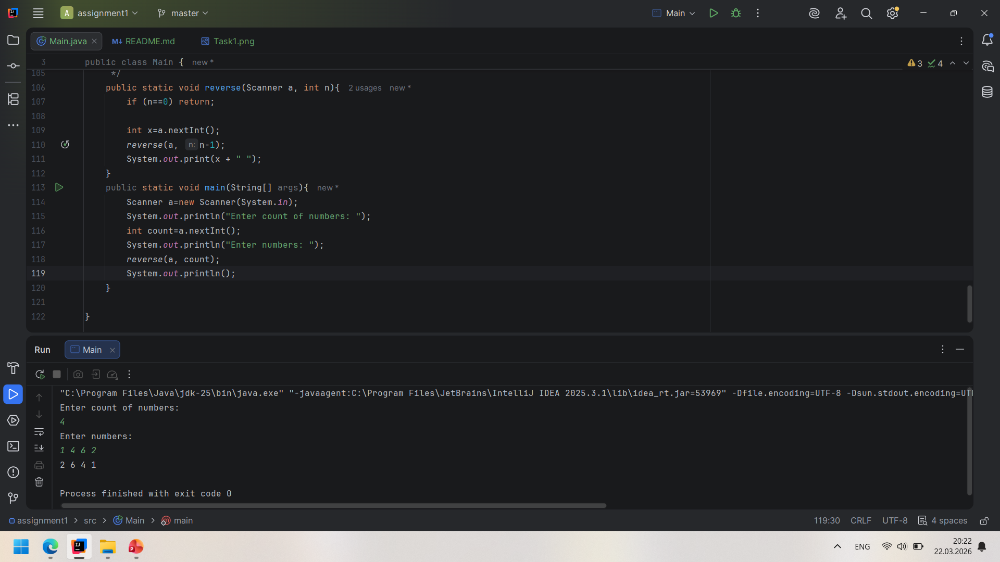
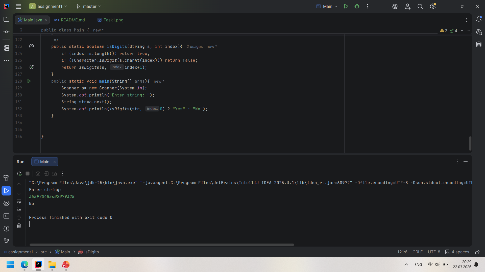
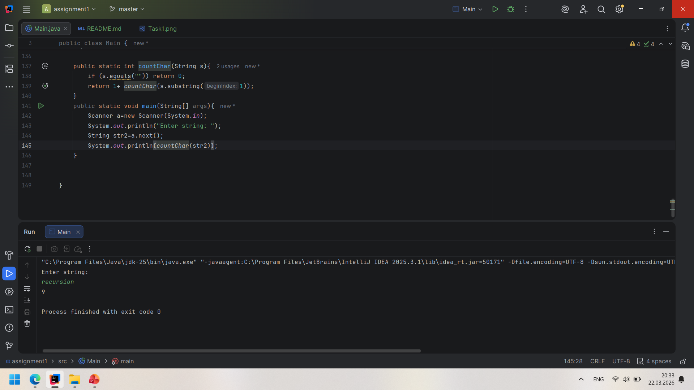
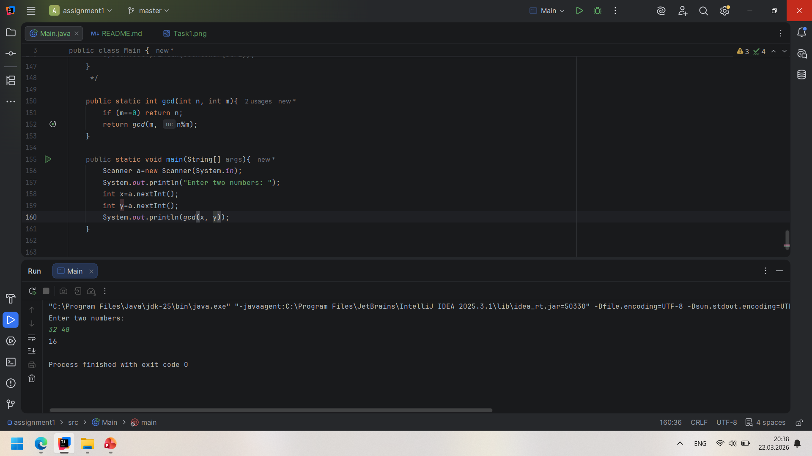

# Assignment 1: Recursion
**Student:** Alima Beisembayeva
**Group:** IT-2504 
## Tasks Implementation
### Task 1: Print Digits of a Number
* **Description:** Recursively prints every digit of an integer on a separate line.
* **Screen:**
### Task 2: Average of Elements
* **Description:** Calculates the sum of elements recursively and computes the average.
* **Screen:** 
### Task 3: Prime Number Check
* **Description:** Checks if a number $n$ is prime using recursion.
* **Screen:** 
### Task 4: Factorial
* **Description:** Calculates $n!$ using recursive calls.
* **Screen:** 
### Task 5: Fibonacci Number
* **Description:** Finds the $n$-th Fibonacci number.
* **Screen:** 
### Task 6: Power Function
* **Description:** Computes $a^n$ recursively.
* **Screen:** 
### Task 7: Reverse Output
* **Description:** Reads $n$ numbers and prints them in reverse order without using an extra
  array.
* **Screen:** 
### Task 8: Check Digits in String
* **Description:** Checks if a string contains only digits.
* **Screen:** 
### Task 9: Count Characters in a String
* **Description:** Counts total characters in a string recursively.
* **Screen:** 
### Task 10: Greatest Common Divisor (GCD)
* **Description:** Finds GCD of two numbers using the Euclidean Algorithm and recursion.
* **Screen:** 

## Work Process Summary
In this assignment, I learn how to solve arithmetic and other problems without using loops. Also I found out new functions such as: "!Character", "charAt", "substring" and etc. and learn how to use them and their function.